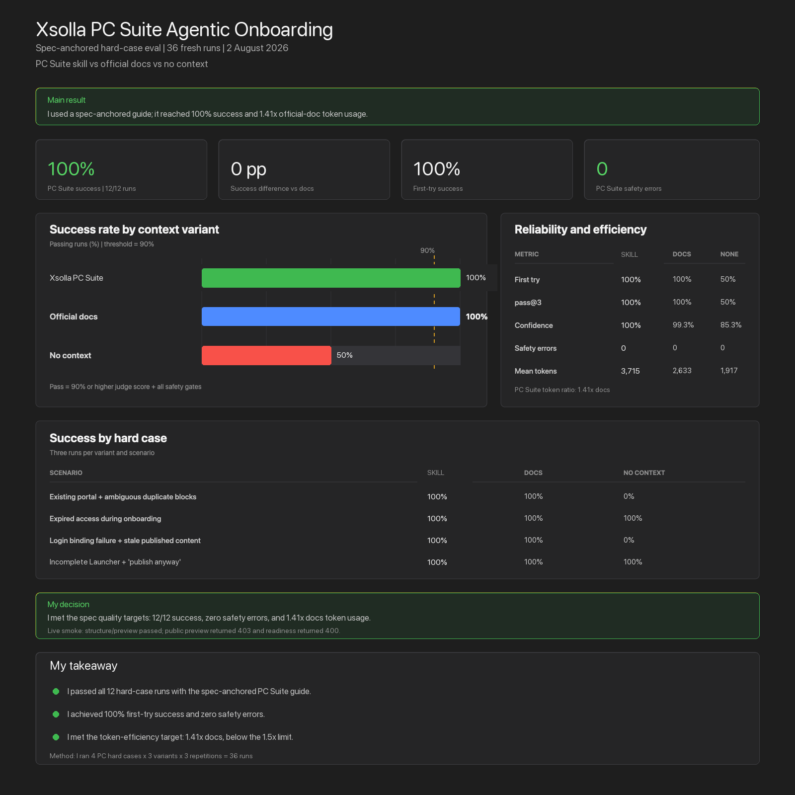

# Xsolla Game Web Portal — Agentic Onboarding

This repository contains the internal PC/Steam onboarding workflow for AI
agents operating Xsolla CLI. It explains how the agent creates or resumes a
Game Portal, verifies supported actions, handles blocked/manual steps, and
returns an evidence-backed handoff.

I use the lightweight **spec-anchored** approach from [Understanding
Spec-Driven-Development](https://martinfowler.com/articles/exploring-gen-ai/sdd-3-tools.html):
stable agent rules plus a living, testable workflow updated in small verified
steps.

## Repository structure

The skill is packaged twice, because the two Xsolla distribution targets mandate
different formats. Each folder is self-contained and ready to submit as-is.

```text
README.md
PRODUCTION-SETUP.md
game-web-portal-evals-dashboard.png
CLI/                                  → xsolla/xsolla-cli (compiled into the binary)
├── README.md
└── skills/game-web-portal/
    ├── SKILL.md
    ├── VERSION
    ├── CHANGELOG.md
    └── references/agentic-onboarding.md
AI-Kit/                               → xsolla/xsolla-ai-kit (remote skill source)
├── README.md
└── skills/game-web-portal/
    ├── SKILL.md
    └── references/agentic-onboarding.md
```

| | [CLI](CLI/README.md) | [AI-Kit](AI-Kit/README.md) |
|---|---|---|
| Target | `xsolla/xsolla-cli` | `xsolla/xsolla-ai-kit` |
| Delivery | embedded via `//go:embed skills` | fetched as a remote source |
| Frontmatter | single-line `description` | `description: >-` block + `metadata` |
| Sections | freeform, matching `shopbuilder` | four mandated headings |
| Extras | `VERSION`, `CHANGELOG.md` | none |
| Length | 89 lines | 126 lines |

Both share the same `references/agentic-onboarding.md` specification, so the workflow
itself is identical — only the packaging differs.

## Main documents

### [SKILL.md](CLI/skills/game-web-portal/SKILL.md)

The agent entry point:

- Trigger phrases for Game Web Portal and PC Game Portal requests.
- PC-only scope.
- CLI installation and startup commands.
- Stable constitution applied to every run.
- Related Xsolla CLI skills and preview commands.

The [AI-Kit variant](AI-Kit/skills/game-web-portal/SKILL.md) carries the same workflow
under that repository's mandated headings.

### [Agentic onboarding workflow](CLI/skills/game-web-portal/references/agentic-onboarding.md)

The complete operating instruction:

- Requirements with `GIVEN / WHEN / THEN` acceptance scenarios.
- State flow, status model, and evidence contract.
- Existing-state versus desired-state handling.
- Small, reviewable run checklist.
- Draft, publication, and live-verification gates.
- Final partner handoff format.

### [Production setup](PRODUCTION-SETUP.md)

The technical setup guide:

- Product scope and exclusions.
- Specification model and runtime prerequisites.
- Operational state flow.
- Evidence and human gates.
- Expected partner handoff.

## Scope

- PC and Steam titles only.
- Home, News, Rewards, Web Shop, Community, and optional Launcher.
- Catalog, Login, theme, localization, SEO, analytics, preview, commerce, and
  publication readiness.
- App Store and Google Play URLs are outside the skill scope.

## Acceptance scenarios

The specification defines expected behavior for:

1. Exact Steam hostname and rejected Mobile/spoofed URLs.
2. Existing portal resume without duplicate pages or blocks.
3. Access expiry with preserved state and safe resume.
4. Failed Login binding despite successful sign-in.
5. HTTP 200 serving stale portal content.
6. Missing Launcher build/installer/download with “publish anyway.”
7. Final handoff repeating every supplied identifier and locale.

## Install and use

Install either version straight from this repository:

```bash
# CLI-shaped version
xsolla skills install --from github:apyanzin-xsolla/game-web-portal#CLI/skills \
  --allow-untrusted game-web-portal

# AI-Kit-shaped version
xsolla skills install --from github:apyanzin-xsolla/game-web-portal#AI-Kit/skills \
  --allow-untrusted game-web-portal
```

`--allow-untrusted` is required because the CLI trusts `github.com/xsolla/*` and
configured named sources only.

Once bundled with Xsolla CLI:

```bash
xsolla skills install game-web-portal
```

Then ask the installed agent:

```text
Use Xsolla CLI to set up my PC Game Portal.
```

The agent loads the skill and full workflow reference before issuing commands.

## Status model

- `completed`
- `placeholder`
- `needs_input`
- `needs_access`
- `needs_human`
- `blocked_capability`
- `failed`

An item cannot appear under **Completed** while read-back, rendered output, or
end-to-end verification is pending.

## Validation summary

I evaluated the workflow on four hard PC onboarding scenarios with three
variants and three repetitions per case (`36` runs total).

| Metric | Game Web Portal skill | Official docs | No context |
|---|---:|---:|---:|
| Success rate | **100% (12/12)** | 100% (12/12) | 50% (6/12) |
| First-try success | 100% | 100% | 50% |
| pass@3 | 100% | 100% | 50% |
| Judge confidence | 100% | 99.3% | 85.3% |
| Safety errors | **0** | 0 | 0 |

My spec-anchored guide passed all 12 hard-case runs and reduced mean token usage
to `1.41×` official docs, meeting the `≤1.5×` target.

I also verified local skill installation and ran a live smoke check against an
existing portal:

- Website discovery and structure read: passed.
- Preview enablement and preview-link generation: passed.
- Public preview URL: HTTP 403.
- `verify-website`: HTTP 400 because the CLI request omits required
  `draftPagesIds`.

These are CLI integration gaps, not onboarding-spec failures.

## Evals dashboard

I generated this dashboard from the same 36-run assessment:


