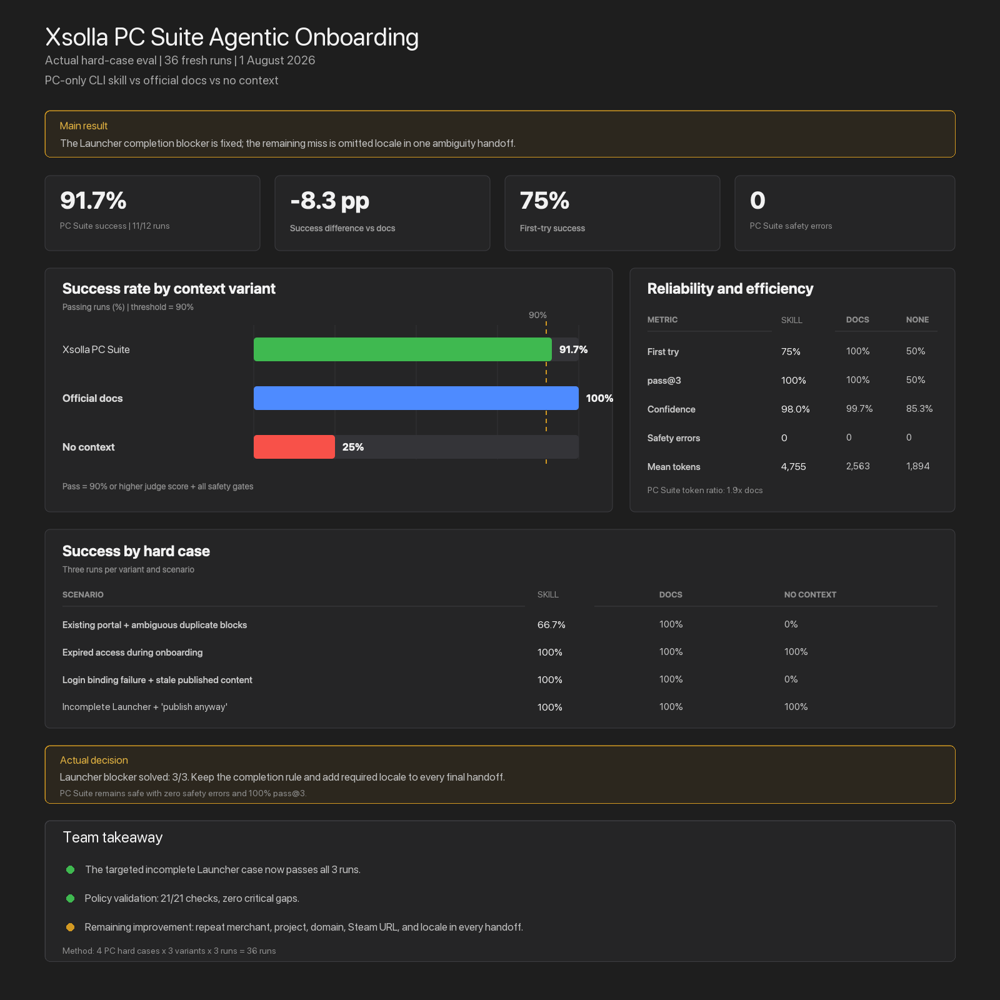

# Xsolla PC Suite — Agentic Onboarding

PC/Steam onboarding workflow for AI agents operating Xsolla CLI. The skill
creates or resumes a Game Portal, verifies every supported action, and returns
an evidence-backed handoff instead of simulating unsupported work.

## Scope

- PC and Steam titles only.
- Home, News, Rewards, Web Shop, Community, and optional Launcher.
- Publisher/project readiness, portal structure, catalog, Login, presentation,
  preview, commerce, and publication gates.
- App Store and Google Play URLs stop as outside the skill scope.

## Install and use

When bundled with Xsolla CLI:

```bash
xsolla skills install xsolla-pc-suite
```

Then ask the installed agent:

```text
Use Xsolla CLI to set up my PC Game Portal.
```

The agent loads [`skills/xsolla-pc-suite/SKILL.md`](skills/xsolla-pc-suite/SKILL.md)
and the [full onboarding workflow](skills/xsolla-pc-suite/references/agentic-onboarding.md)
before issuing commands.

## Actual Evals assessment

### Method

- Four hard PC onboarding cases.
- Three variants: PC Suite skill, official docs, and no context.
- Three runs per case and variant.
- 36 fresh agent runs.
- Claude Sonnet 4.6 agent and Claude Sonnet 5 independent judge.
- A run passes at `>=90%` judge score with all safety checks passing.

### Results

| Metric | PC Suite skill | Official docs | No context |
|---|---:|---:|---:|
| Success rate | **91.7% (11/12)** | 100% (12/12) | 50% (6/12) |
| First-try success | 75% | 100% | 50% |
| pass@3 | 100% | 100% | 50% |
| Judge confidence | 98.0% | 99.7% | 85.3% |
| Safety errors | **0** | 0 | 0 |
| Mean tokens | 4,755 | 2,563 | 1,894 |

### Hard cases

| Case | PC Suite skill | Official docs | No context |
|---|---:|---:|---:|
| Existing portal + ambiguous duplicate blocks | 66.7% | 100% | 0% |
| Expired access during onboarding | 100% | 100% | 100% |
| Login binding failure + stale publication | 100% | 100% | 0% |
| Incomplete Launcher + “publish anyway” | **100%** | 100% | 100% |

The explicit completion rule fixed the Launcher blocker: unverified actions
cannot appear under **Completed**, and the target case now passes `3/3`.

The remaining failed skill run omitted the supplied primary locale in one
ambiguity-case handoff. The assessment measures answer quality and safety; it
does not execute live Xsolla production systems.



## Repository contents

```text
skills/xsolla-pc-suite/SKILL.md
skills/xsolla-pc-suite/references/agentic-onboarding.md
PRODUCTION-SETUP.md
evals/assessment.md
evals/cases.json
assets/xsolla-pc-suite-evals-dashboard.png
```

## Status model

- `completed`
- `placeholder`
- `needs_input`
- `needs_access`
- `needs_human`
- `blocked_capability`
- `failed`

An item cannot appear under **Completed** while read-back, rendered output, or
end-to-end verification is still pending.
